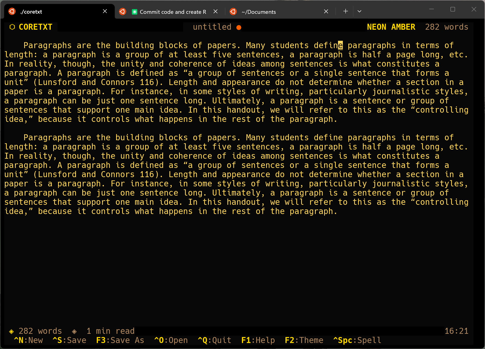

# coretxt

A neon terminal text editor for writing novels and long-form prose. Built with [Bubbletea](https://github.com/charmbracelet/bubbletea).



## Features

- Distraction-free full-screen editing
- Four neon color themes: CYBERPUNK, SYNTHWAVE, MATRIX, NEON AMBER
- Spell check via `aspell`
- File browser for opening existing files
- Undo support
- Mouse support

## Install

```sh
go install coretxt@latest
```

Or build from source:

```sh
git clone https://github.com/keithreally/coretxt
cd coretxt
go build -o coretxt .
```

## Usage

```sh
coretxt [file]
```

Open an existing file or start a new one. If no filename is given, you'll be prompted when saving.

## Keybindings

| Key | Action |
|-----|--------|
| `Ctrl+S` | Save file |
| `Ctrl+Q` | Quit (confirms if unsaved) |
| `Ctrl+C` | Force quit |
| Arrow keys | Move cursor |
| `Ctrl+← / →` | Jump word |
| `Ctrl+Home/End` | Beginning / end of document |
| `PgUp / PgDn` | Scroll page |
| `Enter` | New line |
| `Backspace` | Delete back |
| `Ctrl+W` | Delete word back |
| `Ctrl+K` | Delete to end of line |
| `Ctrl+Z` | Undo |
| `F1` | Toggle help |
| `F2` | Cycle color theme |

## Dependencies

- Go 1.24+
- `aspell` (optional, for spell check)
